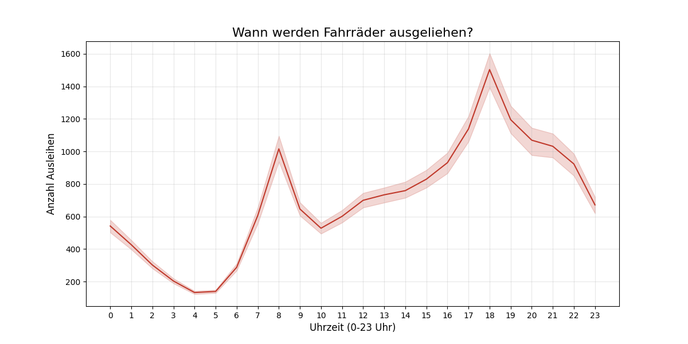
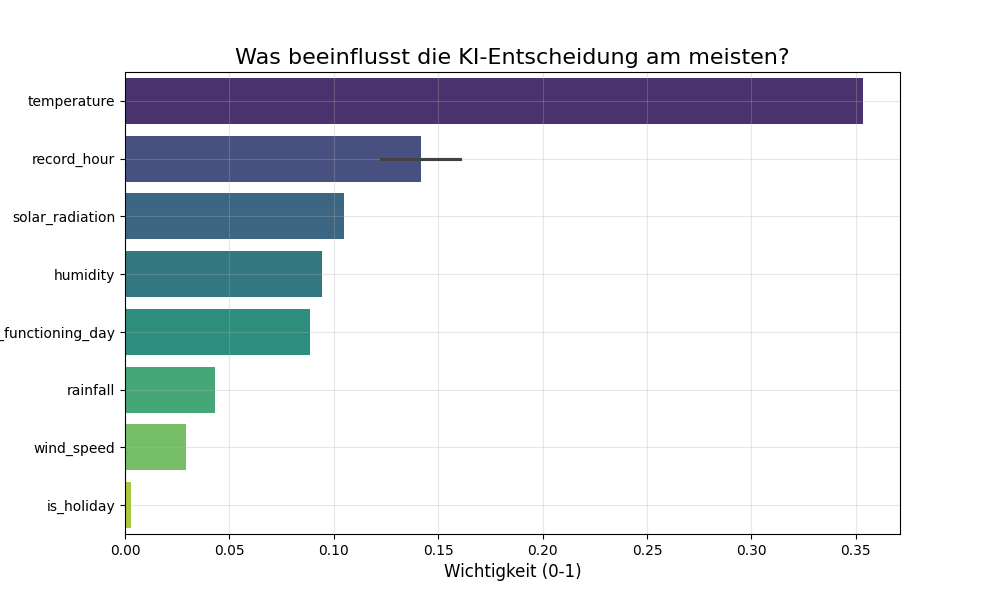
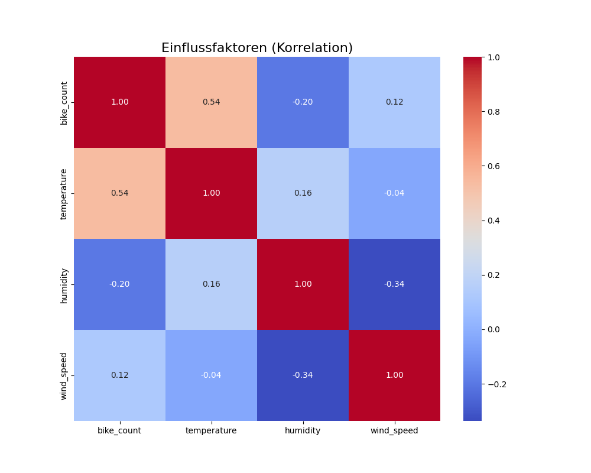

# 🚲 Bike Demand Predictor: End-to-End Data Analysis


## 📋 Projektübersicht
Dieses Projekt ist eine **End-to-End Data Science Case Study**.
Ziel ist es, für einen Fahrradverleih in Seoul vorherzusagen, wie viele Fahrräder zu einer bestimmten Uhrzeit benötigt werden, um Engpässe zu vermeiden.

Das Projekt deckt den gesamten Daten-Lebenszyklus ab:
1.  **Data Engineering:** ETL-Pipeline von CSV in eine normalisierte MySQL-Datenbank.
2.  **Analysis:** Explorative Datenanalyse (EDA) zur Identifikation von Einflussfaktoren.
3.  **Machine Learning:** Training eines Random Forest Regressors (R² = 0.85).
4.  **Deployment:** CLI-Tool und Web-Dashboard für Vorhersagen.

---

## 🛠️ Tech Stack & Skills

* **Languages:** Python
* **Data Manipulation:** Pandas, NumPy
* **Database:** MySQL, SQLAlchemy (Schema Design, Normalization)
* **Visualization:** Seaborn, Matplotlib
* **Machine Learning:** Scikit-Learn (Regression, Feature Importance)
* **App Framework:** Streamlit

---

## 📊 Key Insights (Ergebnisse)

### 1. Wann fahren die Leute? (Rush Hour)
Die Analyse zeigt zwei massive Spitzen im Berufsverkehr (8 Uhr und 18 Uhr).


### 2. Was beeinflusst die Entscheidung?
Die Temperatur ist der stärkste Indikator für die Nachfrage.


### 3. Korrelationen


---

## 🧠 Model Performance

Ich habe ein **Random Forest Modell** trainiert.
* **R² Score:** 0.85 (Erklärt 85% der Varianz)
* **MAE (Mean Absolute Error):** ~150 Räder Abweichung im Schnitt.

---

## 🚀 How to Run

### 1. Clone Repository
```bash
git clone [https://github.com/WaldemarEck/bike-demand-predictor.git](https://github.com/WaldemarEck/bike-demand-predictor.git)
cd bike-demand-predictor